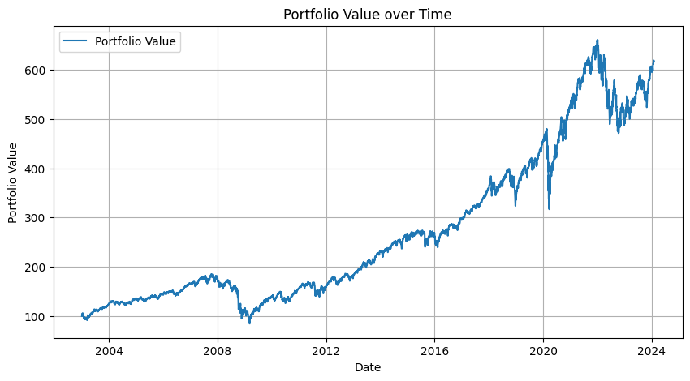
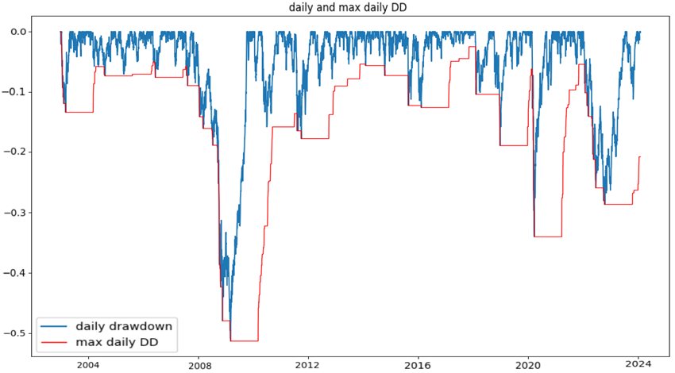
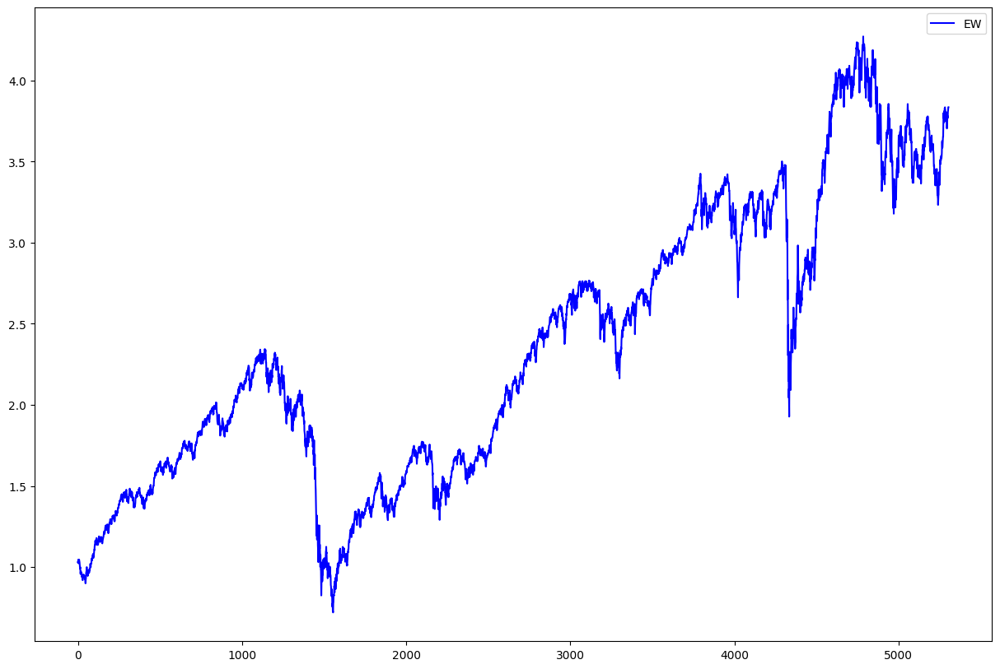

# portfolio-optimization
Implemented and backtested a few risk-based strategies as well as a classical Markowitz risk-retrun strategy

### Description

We compareed our backtests with the american market(S&P 500), for this we got market-weights, for the last approximately 21 years, for some stocks of the S&P500.
One challenge I had is to use yahoo-finance as a database for getting the stocks we got weights for. Here we really had to handle with bad data-quality. 
We needed to find senseful ways to keep as many stocks as we can such that we can replicate the american market in a realistic way and to test our strategies on a lot of stocks.
So we replicated the market, calculated some stats as well as for our different investment strategies, and compared the stats.

### How to build

We worked with a Colab Python Jupyter Notebook.
process: get Market weights and corresponding stockprices for the benchmark-> do the data cleaning(Find out how to handle with NaN's etc) -> caculate the returns, stats and replicate the graph, to validate that everything works -> code the different strategies (e.g. Equally weighted) and compare with the benchmark-> Backtest the different strategies by defininig a sliding window over time -> being creative from here, play with the numbers, the sliding windows, the volatility we accept...

### Replicated market


### Lehman brothers and covid crisis as top two max drawdowns


### Replicated market key risk indicators 
| Performance Measure | Value (%) |
| ------------- | ------------- |
| Annualized Return | 9.0  |
| Annualized Volatility | 18.6  |
| Max Drawdown | -54  |
| Max Drawdown | -1.7  |
| Sharpe Ratio | 0.48  |

### Risk Based strategies
## Equally Weighted Portfolio (EW)
This portfolio is calculated every trading day. It will assign the same weight to all the stocks currently available that day. It is the most rudimentary of the risk-based approaches. It aims to spread the risk out among as many stocks as possible without going into complex and costly variance analysis.

$\Large w_{EW}= \frac{\mathbb{1} \textbf{1}}{\textbf{1}^t \mathbb{1} \textbf{1}}$

$\textbf{1}$: is a vector of ones(with the stocks available at the date of optimization)

$\mathbb{1}$: Identity Matrix


| Performance Measure | Value (%) |
| ------------- | ------------- |
| Annualized Return | 6.3  |
| Annualized Volatility | 18.1  |
| Max Drawdown | -58.4  |
| Max Drawdown | -1.65  |
| Sharpe Ratio | 0.35  |

## Equally Risk Based portfolio (ERB)


```ruby

```
