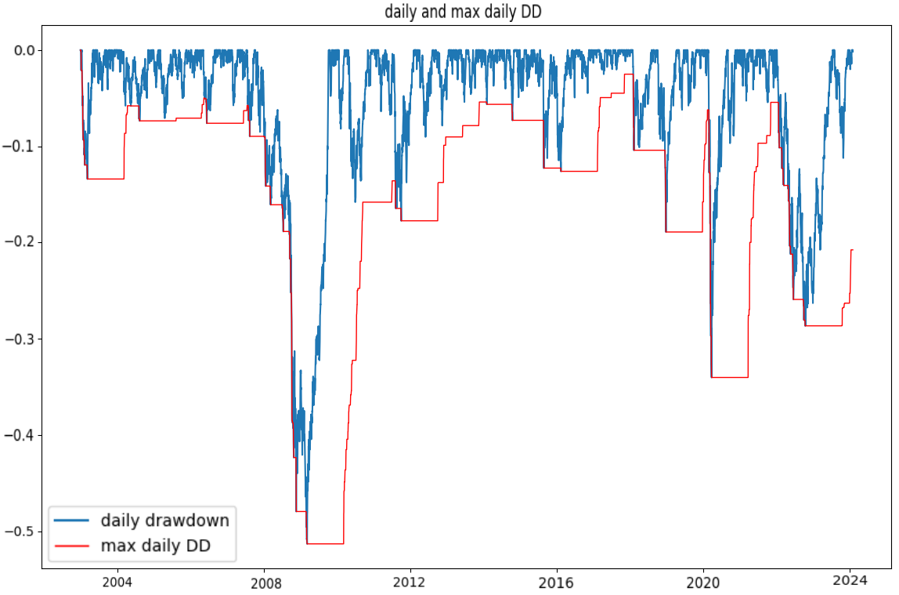

# portfolio-optimization
Implemented and backtested a few risk-based strategies as well as a classical Markowitz risk-retrun strategy

### Description

We compareed our backtests with the american market(S&P 500), for this we got market-weights, for the last approximately 21 years, for some stocks of the S&P500.
One challenge I had is to use yahoo-finance as a database for getting the stocks we got weights for. Here we really had to handle with bad data-quality. 
We needed to find senseful ways to keep as many stocks as we can such that we can replicate the american market in a realistic way and to test our strategies on a lot of stocks.
So we replicated the market, calculated some stats as well as for our different investment strategies, and compared the stats.

### How to build

We worked with a Colab Python Jupyter Notebook.
process: get Market weights and corresponding stockprices for the benchmark-> do the data cleaning(Find out how to handle with NaN's etc) -> caculate the returns, stats and replicate the graph, to validate that everything works -> code the different strategies (e.g. Equally weighted) and compare with the benchmark-> Backtest the different strategies by defininig a sliding window over time -> being creative from here, play with the numbers, the sliding windows, the volatility we accept...

### Replicated American market


### Lehman brothers and Covid crisis as top two Max drawdowns with a yearly sliding window over 21 years



```ruby

```
