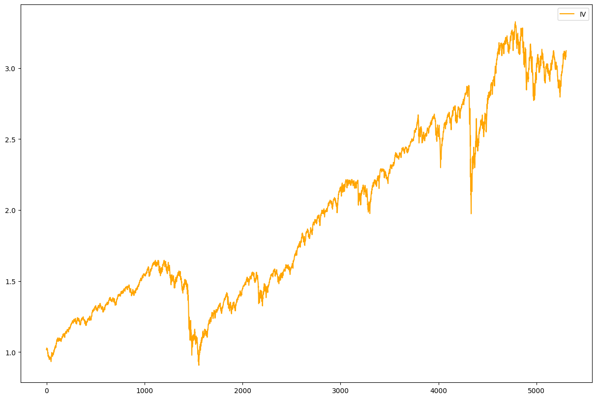
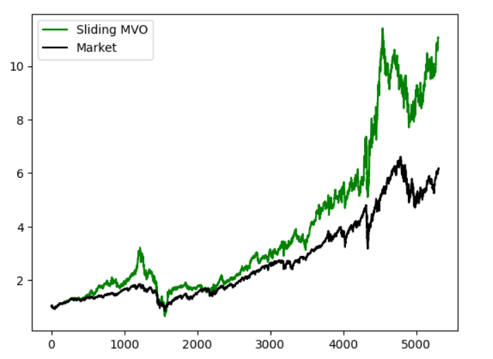

# portfolio-optimization
Implemented and backtested a few risk-based strategies as well as a classical Markowitz risk-retrun strategy

### Description

We compareed our backtests with the american market, for this we got market-weights, for the last approximately 21 years, for some stocks of the S&P500.
One challenge we had is to use yahoo-finance as a database for getting the stocks we got weights for. Here we really had to handle with bad data-quality. 
We needed to find senseful ways to keep as many stocks as we can such that we can replicate the american market in a realistic way and to test our strategies on a lot of stocks.
So we replicated the market, calculated some stats as well as for our different investment strategies, and compared the stats.

### How to build

We worked with a Colab Python Jupyter Notebook.
process: get market-weights and corresponding stock-prices for the benchmark -> do the data cleaning(Find out how to handle with NaN's etc) -> caculate the returns, stats and replicate the graph, to validate that everything works -> code the different strategies (e.g. Equally weighted) and compare with the benchmark -> Backtest the different strategies by defininig a sliding window over time -> being creative from here, play with the numbers, the sliding windows, the volatility we accept...

### Replicated market

### Lehman brothers and covid crisis as top two max drawdowns

### Replicated market key risk indicators 
| Performance Measure | Value (%) |
| ------------- | ------------- |
| Annualized Return | 9.0  |
| Annualized Volatility | 18.6  |
| Max Drawdown | -54  |
| Max Drawdown | -1.7  |
| Sharpe Ratio | 0.48  |

### Risk Based strategies (Static, only one Portfolio each)
## Equally Weighted Portfolio (EW)
This portfolio is calculated every trading day. It will assign the same weight to all the stocks currently available that day. It is the most rudimentary of the risk-based approaches. It aims to spread the risk out among as many stocks as possible without going into complex and costly variance analysis.

$\Large w_{EW}= \frac{\mathbb{1} \textbf{1}}{\textbf{1}^t \mathbb{1} \textbf{1}}$

$\textbf{1}$: is a vector of ones(with the stocks available at the date of optimization)

$\mathbb{1}$: Identity Matrix

| Performance Measure | Value (%) |
| ------------- | ------------- |
| Annualized Return | 6.45  |
| Annualized Volatility | 21.56|
| Max Drawdown | -69.28  |
| Max Drawdown | -1.98  |
| Sharpe Ratio | 0.3  |

## Equally Risk Based portfolio (ERB)
The $\Lambda$ matrix has been calculated with the whole price dataset. The weights thus obtained have then been tested on the whole historical data. The $\Lambda^{-1}$ matrix is of diagonal structure. For each stock, the inverse of the standard deviation is present on the diagonal. It is then normalized by being divided by the sum for all stocks of the inverse standard deviation. This portfolio aims to reduce risk by penalizing standard deviation : the higher the standard deviation, the lower the weight used in the portfolio.

$\Large w_{ERB}=\frac{\Lambda^{-1}\textbf{1}}{\textbf{1}^t \Lambda^{-1} \textbf{1}}$

$\Lambda$: Diagonal matrix with standard deviation on the diagonal

| Performance Measure | Value (%) |
| ------------- | ------------- |
| Annualized Return | 6.32  |
| Annualized Volatility | 18.06|
| Max Drawdown | -58.40  |
| Max Drawdown | -1.65  |
| Sharpe Ratio | 0.35  |

## Inverse Variance Portfolio(IV)
The weights thus obtained have then been tested on the whole historical data. Note that the $\Lambda$ matrix here is the same as the one for the ERB portfolio. The $(\Lambda^{2})^{-1}$ matrix is of diagonal structure. For each stock, the inverse of the variance is present on the diagonal. It is then normalized by being divided by the sum for all stocks of the inverse variance. This portfolio aims to reduce risk by penalizing variance : the higher the variance, the lower the weight used in the portfolio. 

$\Large w_{IV}=\frac{(\Lambda^2)^{-1}\textbf{1}}{\textbf{1}^t (\Lambda^2)^{-1} \textbf{1}}$

| Performance Measure | Value (%) |
| ------------- | ------------- |
| Annualized Return | 5.47  |
| Annualized Volatility | 13.36|
| Max Drawdown | -44.90  |
| Max Drawdown | -1.21  |
| Sharpe Ratio | 0.41  |

### Risk Based strategies (Backtesting, equidistant weight updates)
To ground ourselves in a more realistic setting, at any given date we will limit our portfolio construction algorithms to the data available at that date. The idea of the backtest is to use data from let's say the previous two years to build a portfolio that we can use for the next let's say 5 days and then start again. These are the two main variables of the code : the number of previous days of data we use to construct our portfolios and the number days on which project our strategy. For instance, we can calculate our weights based on the last 400 days and then use the portfolio for the next 20 days before recalculating the weights and so on.

In our code, we have called this process a "Sliding portfolio strategy" because we only use data from a set number of days away. For instance, we say we will use the data from the previous T days. That means at date $t_1$ we will use the data included in [$t_1 - T$, $t_1$] and at date $t_2$  we will use the data included in [$t_2 - T$, $t_2$].

The Equally Weighted portfolio is not going to change from the previous code because it is calculated for each trading day as it is the simplest portfolio we have implemented. It doesn't use any data from the past. 

For both the Backtested ERB and Backtested IV portfolios, the $\Lambda$ matrix will now be calculated for the past 500 days of data and the portfolio thus calculated will be used for 15 days before the  $\Lambda$ matrix is calculated again with the past 500 days and so on.

$\textbf{Backtested Equally Risk Based Portfolio (BERB)}$

| Performance Measure | Value (%) |
| ------------- | ------------- |
| Annualized Return | 6.53  |
| Annualized Volatility | 22.16|
| Max Drawdown | -72.69  |
| Max Drawdown | -2.02  |
| Sharpe Ratio | 0.29 |

As we could expect, the BERB is far less successful than the ERB portfolio. It's returns rise from 6.32\% to 6.53\%, however the risk also rises (from 18.06\% annualized volatility with the ERB to 22.16\% with the BERB).  This leads to a strong decline in the Sharpe ratio from 0.35 to 0.29. The ERB should be a risk adverse portfolio so this rise in volatility that fails to be compensated by an equal rise in returns, thus leading to a fall of the Sharpe ratio, is not welcome. This poorer performance can be explained by the way we have built both the BERB and the ERB portfolios : the ERB $\Lambda$ matrix uses the data of 5305 trading days, but the BERB one only uses 500 trading days. This increase in data availability leads to a more efficient portfolio.

As we can see, the annualized volatility of the BERB portfolio is higher than that of the SPX index, which has an annualized volatility of 18.6\%. It fails in what it was designed to do : lower volatility. It gives us higher volatility for less returns. Any investor is better off with our SPX index.

$\textbf{Backtested Inverse-variance portfolio (BIV)}$

| Performance Measure | Value (%) |
| ------------- | ------------- |
| Annualized Return | 5.96  |
| Annualized Volatility | 20.94|
| Max Drawdown | -70.40  |
| Max Drawdown | -1.88  |
| Sharpe Ratio | 0.28 |

As in the previous case, the BIV is far less successful than the BIV portfolio. It's returns rise from 5.47\% to 5.96\%, however the risk also rises (from 13.36\% annualized volatility with the IV to 20.94\% with the BIV).  This leads to a significant drop in the Sharpe ratio from 0.41 to 0.28. Just as previously, the IV should be a risk adverse portfolio so this rise in volatility that fails to be compensated by an equal rise in returns, thus leading to a fall of the Sharpe ratio, is not welcome. Just like in the previous case, this poorer performance can be explained by the way we have built both the BIV and the IV portfolios : the IV $\Lambda$ matrix uses the data of 5305 trading days, but the BIV one only uses 500 trading days. This increase in data availability leads to a more efficient portfolio.

As we can see, the annualized volatility of the BIV portfolio is higher than that of the SPX index, which has an annualized volatility of 18.6\%. Just like previously, it fails in what it was designed to do : lower volatility. It gives us higher volatility for less returns. Any investor is better off with our SPX index.

$\textbf{Value of BERB and BIV portfolios over time}$

$\textbf{Backtested minimum variance portfolio (BMV)}$
We will now introduce a new risk-based portfolio : the minimum variance portfolio. As the name suggests, the aim of the portfolio is to compute the weights in such a way that the variance of the whole portfolio is minimized. In the ERB and IV portfolios, we did not look at the relationship between the stocks, we only looked at each stocks individual volatility. In order to minimize the volatility of the portfolio, the weights will be computed with the covariance between each pair of stocks taken into account. The $\Sigma$ matrix used for the computation is the standard covariance matrix of all the stocks used in the computation. In this backtest, the covariances and variances were computed over the last 400 days of data. The weights were then used for the next 20 days and so on. For a stock to be used in the computation, its price over the last 400 days of data at the time of the 

$\Large w_{BMV} = \frac{\Sigma^{-1} \textbf{1}}{\textbf{1}^t \Sigma^{-1} \textbf{1}}$

$\Sigma$: Covariance Matrix

| Performance Measure | Value (%) |
| ------------- | ------------- |
| Annualized Return | 6.47  |
| Annualized Volatility | 15.79|
| Max Drawdown | -46.01  |
| Max Drawdown | -1.43  |
| Sharpe Ratio | 0.41 |

Contrary to the BERB and BIV portfolios, the BMV one keeps a Sharpe ratio well above 0.30 (it is at 0.41) whilst also keeping a low volatility (from 22.16\% annualized volatility for the BERB and 20.94\% for the BIV to 15.79\% annualized volatility for the BMV). This shows us that in a real world situation, in order to minimize risk it is crucial to take the relationship between the different stocks into account. Contrary to both the BIV and the BERB, it is the only portfolio that has an annualized volatility under that of the SPX index (18.6\% annualized volatility for the SPX index). It is the only good choice for a risk adverse investor among the three portfolios.

## Top Performance Portfolio, using Double filtration

We will now introduce a new  portfolio : the Top Performers portfolio. It will take a certain number of stocks who have the highest average returns over a given period of time. Then, out of those highest returns stocks, it will only keep a certain number of ones with the lowest volatility over that same period of time. We could have called this portfolio the "Double Filtration" portfolio. In the "first filtration", we only keep the stocks with the highest returns and in the second filtration, out of the previous filtered stocks, we only keep those with the lowest volatility. It has two crucial parameters : the number of stocks we keep after the first filtration and the number of stocks we keep after the second filtration. 

For example, the data below originates from the following parameters : 

1) We keep the first 300 stocks with the highest average returns over the last 400 days.

2) Out of those 300 previous stocks, we only keep the first 80 stocks with the lowest average volatility over the last 400 days.

3) We use an equally weighted strategy on the remaining 80 stocks and use them for 20 days.

| Performance Measure | Value (%) |
| ------------- | ------------- |
| Annualized Return | 7.04  |
| Annualized Volatility | 12.70|
| Max Drawdown | -33.21  |
| Max Drawdown | -1.23  |
| Sharpe Ratio | 0.56 |

$\textbf{Top Performer vs. Market}$

## Markowitz Optimization

The Markowitz optimization, also known as mean variance optimization, is a portfolio optimization technique that aims to maximize the expected return of a portfolio while minimizing its risk. The risk is measured by the portfolio volatility, which is a function of the individual asset volatilities and their correlations. The Markowitz optimization is based on the modern portfolio theory (MPT), which assumes that investors are risk-averse and seek to maximize their expected return for a given level of risk.

The Markowitz optimization problem can be formulated as follows:

where $w$ is the vector of portfolio weights, $\mu$ is the vector of expected asset returns, $\Sigma$ is the covariance matrix of asset returns, and $\lambda$ is the risk aversion parameter. The first constraint ensures that the sum of the portfolio weights is equal to one, and the second constraint ensures that the weights are non-negative and do not exceed one.

We applied the Markowitz optimization to our portfolio of stocks using the historical returns as inputs. We computed our covariance matrix using the price data of the last 500 days and we computed our expected returns using the returns data of the last 30 days. We then used the weights thus optimized for the next 30 days before starting the cycle all over again. We used a risk aversion parameter of $\lambda = 30$ and obtained the following results:

| Performance Measure | Value (%) |
| ------------- | ------------- |
| Annualized Return | 11.97  |
| Annualized Volatility | 26.01|
| Max Drawdown | -79.99  |
| Max Drawdown | -2.28  |
| Sharpe Ratio | 0.46 |

We find that the returns of the MVO portfolio are nearly 3\% higher than those of the SPX index (the market). In exchange for these higher returns, the volatility of the MVO portfolio soars to 26.01\% of annualized volatility, compared to 18.6\% for the market. This tradeoff seems to be justified as the Sharpe ratio only slightly drops from 0.48 for the market to 0.46 for the MVO. This means we have successfully built an alternative investment to the market with potentially higher returns that compensate the increased risk. This is suitable for less risk adverse investors.

$\textbf{MVO vs. Market}$

##Summary

